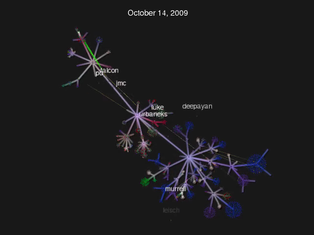
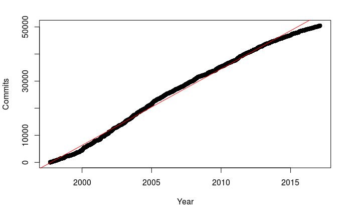
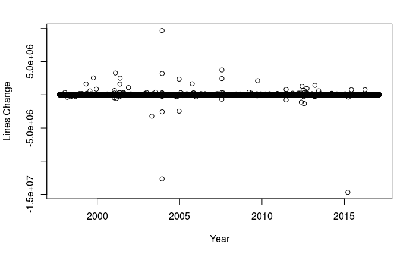
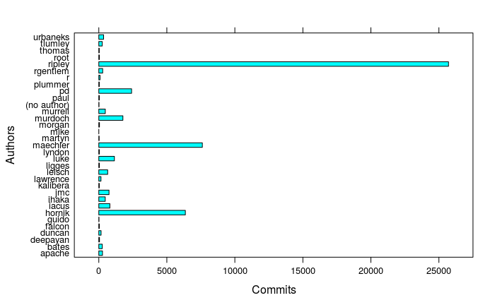
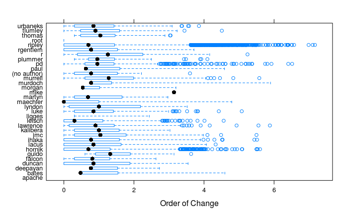

# Introduction

Source code repository visualization techniques have greatly improved
over the last few years, providing great insight into how the software
we use was created.  This is inspiration for seeing what else may be
understood from examining information hidden away within a code
repository.  We investigate the R source code as a source for data
which will then be analyzed with the R programming language.

# Data Collection

Data collection is a straightforward process of downloading a GitHub
mirror of the R source code.[^1]  After this we converted metadata of
the source code commits to JSON, recording the author, date, paths
modified, and lines added and removed.  This process was performed by
a script that converts the output of **git log** to JSON.

<!---
Example **git log** entry:

    commit 4c3f25fd118abb2c7092cfa27c67f5e2485860ab
    Author: ripley <ripley@00db46b3-68df-0310-9c12-caf00c1e9a41>
    Date:   Sun Feb 12 11:53:57 2017 +0000

    updates, especially about append mode

    git-svn-id: https://svn.r-project.org/R/trunk@7215800db46b3-68df-0310-9c12-caf00c1e9a41

     src/library/utils/man/download.file.Rd | 6 +++---
     1 file changed, 3 insertions(+), 3 deletions(-)

Resulting JSON entry:

    {
      "commit": "4c3f25fd118abb2c7092cfa27c67f5e2485860ab",
      "author": "ripley <ripley@00db46b3-68df-0310-9c12-caf00c1e9a41>",
      "date": "2017-02-12 11:53:57 +0000",
      "message": "updates-especially-about-append-mode",
      "paths": [
        {
          "insertions": "3",
          "deletions": "3",
          "path":
          "src/library/utils/man/download.file.Rd"
        }
      ]
    },
--->

The resulting JSON files were processed using a custom C++ program to
compute a total lines added and removed (instead of a per-file lines
added and removed) and clean up the author name.

The source to the conversion and processing programs are available on
GitHub.[^2]

<!---
# Data Visualization with Gource

Our preferred tool for performing 3D visualization of a repository is
the open source application Gource.[^3] This program visualizes the
source code as a tree with directories as nodes and files as leaf
nodes.  Users are visualized as pawn pieces as they move from
directory to directory committing to files, which is presented as
"laser" beams from the pawn to the files modified.

During run time, Gource allows for navigating through the tree
allowing for details to be viewed during visualization.  A video of
Gource operating on the R source is also available on GitHub.[^2]
--->

# Data Analysis

Using the jsonlite package to import the JSON dataset, we investigated
the total number of commits, each author's contributions, and the
sizes of contributions each author made.

## Rate of Commits

We began investigating the rate of commits, expecting to see a rapid
increase as more contributors joined the team and better tooling
reduced the efforts in testing and submitting changes.  Instead we
found that over the last 20 years, commit rates had held fairly linear
with a drop off in recent time.  This could be attributed to the
project being mature with new features being added as R packages and
not language changes.

\

### Commit Sizes Over Time

Next we investigated if we could identify major features and code
changes by looking at commit sizes over time.  One major event that
caught our attention took place in 2004 in which 5 million lines of
code were deleted and then added in the next commit.  It was tracked
down to a code restructuring when implementing 64-bit support.

\

## Author's Contributions

We looked at the contributions of each author to see if we could
identify who were the major committers, and if they could be divided
between feature developers and bugfix developers.
\

### Number of Commits

As demonstrated by in the next figure, the vast majority of changes to
R are committed by only a few developers.  Most commits are small,
implying that they are likely to be bugfixes or small changes to
existing functionality, not new features.

\

### Commit Sizes

The next figure shows that the same developers who commit the most
tend to make the largest commits.  This implies that the regular
developers are also the developers who have implemented the major
language features.

\

# Conclusion

The R programming language is developed by only a handful of
programmers.  Of this group, only about 4 developers are very active
and they produce both the major features and the bug fixes.

[^1]: https://github.com/wch/r-source
[^2]: https://github.com/oursland/r-commits
[^3]: http://gource.io/
